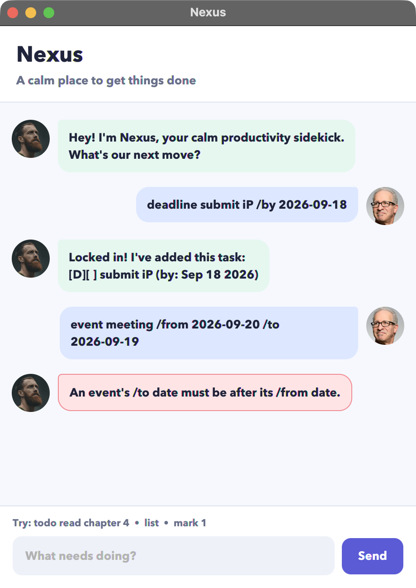

# Nexus User Guide

Nexus is a calm productivity chatbot for keeping todos, deadlines, and events
in one lightweight task list. It saves every successful change automatically,
so your tasks are waiting when you return.



## Quick start

1. Install Java 25.
2. Download `nexus.jar` from the latest GitHub release.
3. Put the JAR in the folder where you want Nexus to keep its `data` folder.
4. Open a terminal in that folder and run:

   ```shell
   java -jar nexus.jar
   ```

Type a command in the box at the bottom and press <kbd>Enter</kbd> or select
**Send**. Commands are not case-sensitive only where explicitly noted; enter
command words such as `todo` and `list` in lowercase.

## Add a todo

Use a todo for something without a specific date.

**Format:** `todo DESCRIPTION`

**Example:** `todo read chapter 4`

Nexus ignores extra spaces around and between words, so accidental repeated
spaces do not create a strangely formatted task. A description is required and
cannot contain the `|` character, which Nexus reserves for its saved-data format.

## Add a deadline

Use a deadline for work that must be finished by a date.

**Format:** `deadline DESCRIPTION /by YYYY-MM-DD`

**Example:** `deadline submit report /by 2026-09-18`

Use exactly one `/by` marker and a real calendar date such as `2026-09-18`.

## Add an event

Use an event for an activity spanning two dates.

**Format:** `event DESCRIPTION /from YYYY-MM-DD /to YYYY-MM-DD`

**Example:** `event orientation /from 2026-09-20 /to 2026-09-21`

Use one `/from` followed by one `/to`. The `/to` date must be later than the
`/from` date.

## View and arrange tasks

| Command | What it does |
| --- | --- |
| `list` | Displays every task with its current task number. |
| `find KEYWORD` | Displays tasks whose descriptions contain the keyword. |
| `sort` | Sorts all tasks alphabetically by description and saves the order. |

Search is not case-sensitive. For example, `find REPORT` matches both
`write report` and `Review Report`.

## Update tasks

Use the number shown by `list` or `sort`:

| Command | What it does |
| --- | --- |
| `mark NUMBER` | Marks a task as completed. |
| `unmark NUMBER` | Marks a task as incomplete. |
| `delete NUMBER` | Permanently removes a task. |

For example, `mark 2` completes the second task. Task numbers must be positive
whole numbers that currently exist in the full task list. Numbers shown in
`find` results identify matches and should not be used as full-list positions;
run `list` before updating a task if you are unsure.

## Exit Nexus

Enter `bye`. Nexus displays a farewell and then closes the window.

## Errors and saved data

Errors appear in coral-colored bubbles and explain how to correct the command.
Invalid commands do not change your task list.

Nexus stores tasks in `data/nexus.txt`, relative to the folder from which you
run the JAR. Do not edit this file while Nexus is open. If individual saved
records are damaged, Nexus restores the valid records and tells you how many it
skipped. If the file cannot be read or a change cannot be saved, Nexus reports
the problem instead of crashing or pretending the change succeeded.

## Command summary

```text
todo DESCRIPTION
deadline DESCRIPTION /by YYYY-MM-DD
event DESCRIPTION /from YYYY-MM-DD /to YYYY-MM-DD
list
find KEYWORD
sort
mark NUMBER
unmark NUMBER
delete NUMBER
bye
```
